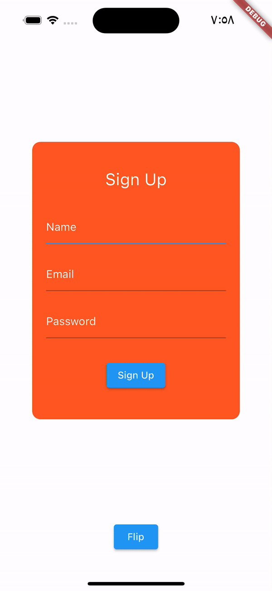

## Flutter Project Overview

This Flutter project demonstrates a flipping card animation widget. It consists of two card views: the login card and the sign-up card. The user can flip between these cards by tapping on the card or using the "Flip" button.

### Demo GIF

### Features

- Flipping Animation: The widget includes an animation that rotates the card from the front view to the back view and vice versa.
- Login Card: The front side of the card displays a login form with email and password fields. It also has a "Log In" button.
- Sign-Up Card: The back side of the card shows a sign-up form with name, email, and password fields. It also includes a "Sign Up" button.

### Functionality

- Tap Gesture: The user can tap on the card to trigger the flip animation.
- AnimatedBuilder: The card animation is controlled using the `AnimatedBuilder` widget, which listens to changes in the animation controller's value and rebuilds the widget tree accordingly.
- Animation Controller: The widget uses an `AnimationController` to manage the animation duration and progress. It also listens to the controller's value changes to update the UI.
- Form Input: The login and sign-up forms include text form fields for user input. The input is not processed or stored; it simply demonstrates the form fields' appearance.
- Print Statements: The "Log In" and "Sign Up" buttons print messages to the console when pressed.

### Usage

To use this flipping card animation in your Flutter project:

1. Copy the code into your project's main Dart file.
2. Replace any existing code or widgets as needed.
3. Run the project to see the flipping card animation in action.

For more information on Flutter development, refer to the [Flutter documentation](https://flutter.dev/docs).
